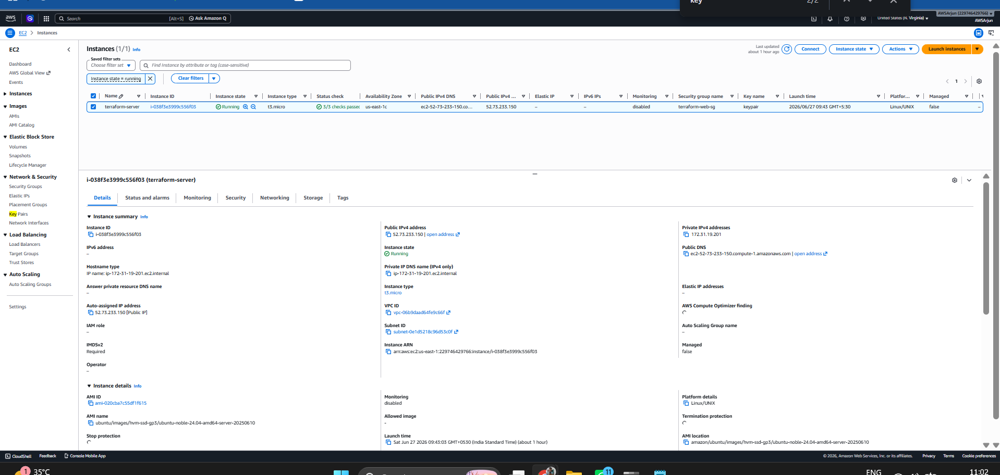
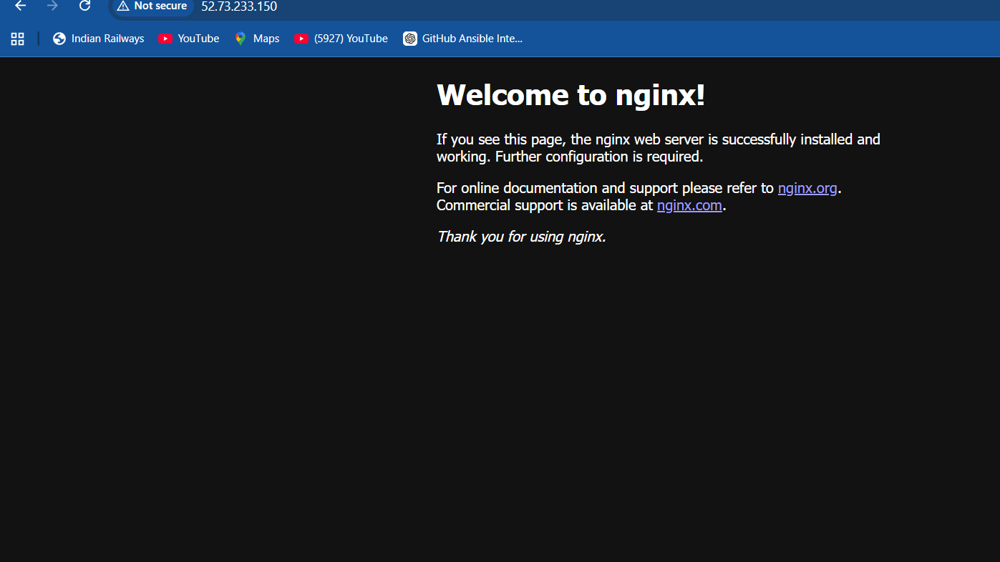
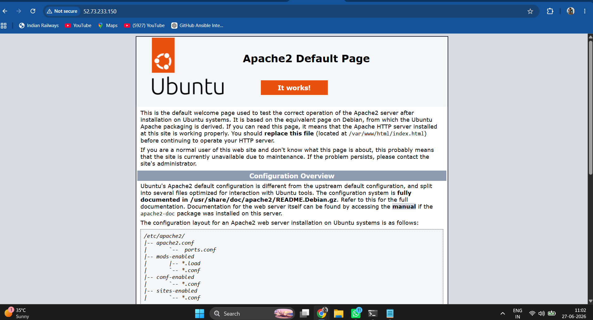
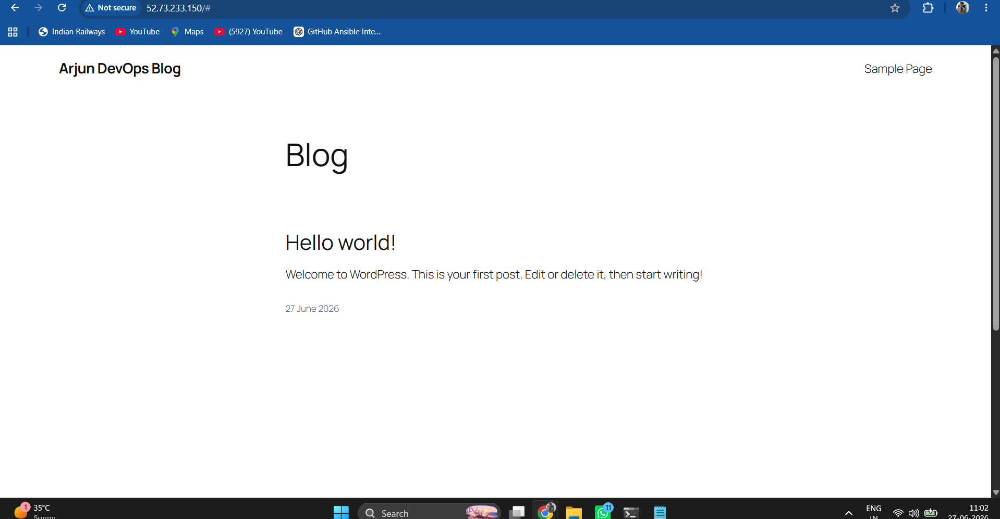

# Terraform WordPress Deployment on AWS EC2

## Project Overview

This project provisions AWS infrastructure using Terraform and deploys a WordPress application on an Ubuntu EC2 instance using Apache2 and PHP.

---

## Architecture

Internet
   |
   V
Security Group
   |
   V
EC2 Instance (Ubuntu 24.04)
   |
   V
Apache2 + PHP
   |
   V
WordPress

---

## Technologies Used

- Terraform
- AWS EC2
- Security Groups
- Ubuntu 24.04
- Apache2
- PHP
- WordPress
- SSH

---

## Infrastructure Components

- EC2 Instance (t3.micro)
- Security Group
- SSH Access
- HTTP Access (Port 80)
- Apache Web Server
- PHP Runtime
- WordPress CMS

---

## Deployment Steps

### 1. Initialize Terraform

```bash
terraform init
```

### 2. Validate Configuration

```bash
terraform validate
```

### 3. Review Infrastructure Plan

```bash
terraform plan
```

### 4. Provision Infrastructure

```bash
terraform apply
```

### 5. SSH into EC2

```bash
ssh -i keypair.pem ubuntu@PUBLIC_IP
```

### 6. Install Apache, PHP and WordPress

```bash
sudo apt update
sudo apt install apache2 php mysql-client php-mysql unzip wget -y
```

### 7. Configure WordPress

Access:

```
http://PUBLIC_IP
```

---

## Screenshots

### AWS EC2 Instance



---

### Nginx Default Page



---

### Apache Default Page



---

### Final WordPress Deployment



---

## Final Output

Successfully provisioned AWS infrastructure using Terraform and deployed WordPress on Apache2 running on Ubuntu EC2 instance.
